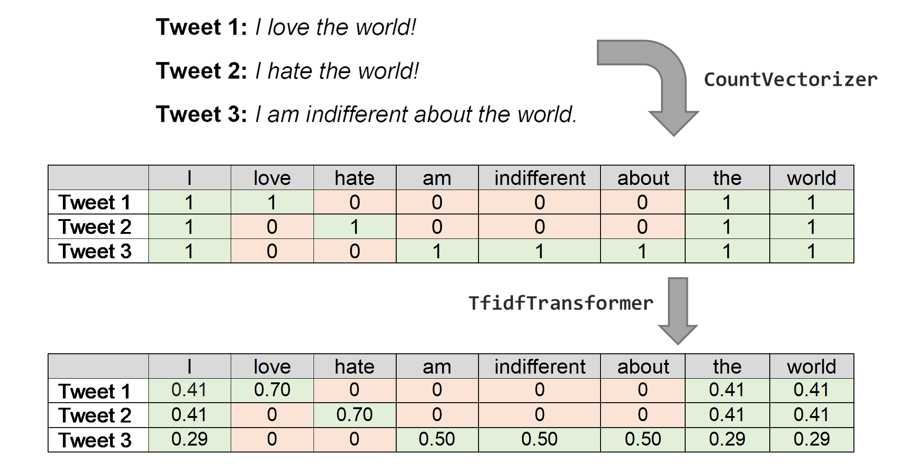
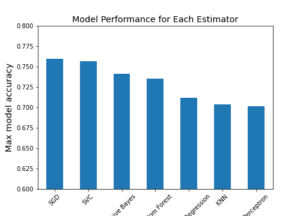
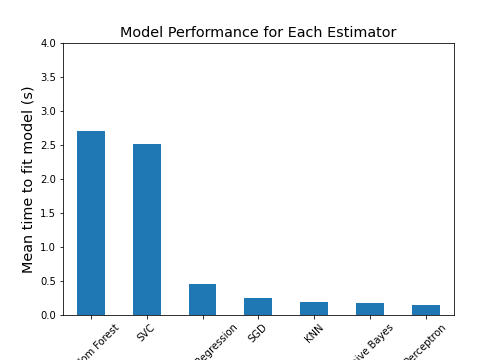
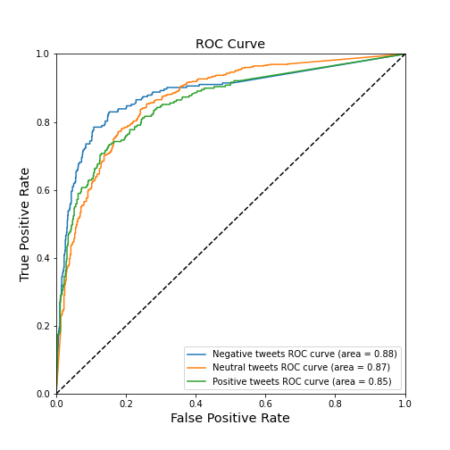
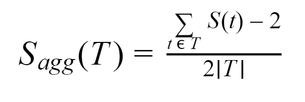
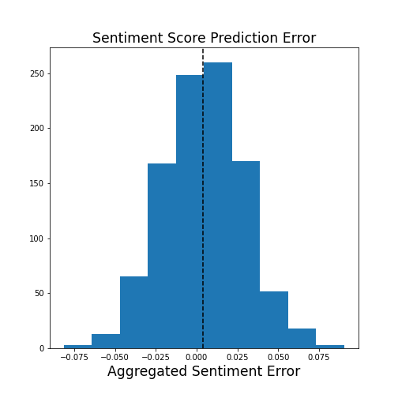
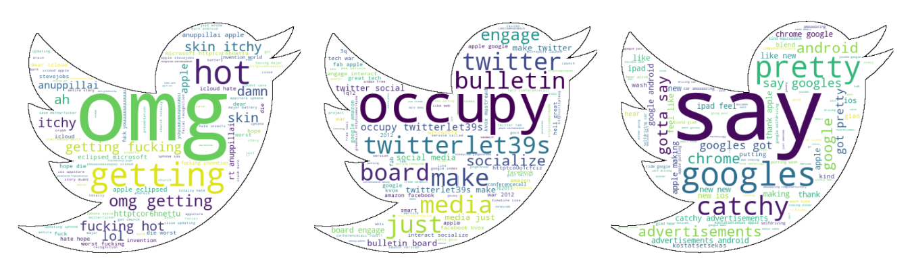

# Purpose

This is the final project for the course Mathematical Techniques in Data Science (MATH 637) at the University of Delaware. The course instructor is Dr. Dominique Guillot. The team members associated with this project are Olivia Mwangi, Desiderio Pilla, and Akshaya Ramesh, who are all students in the Master of Science in Data Science (MSDS) program at UD.


# Abstract

Social media has created a new way for individuals to express their thoughts and opinions. This medium is used by an estimated 2.95 billion people worldwide, generating a massive platform for ideas to be shared. Sentiment analysis, or opinion analysis, is the process of retrieving textual information and discerning which emotions are exhibited by the author. This type of analysis is used in many ways, including: determining consumers’ perception of a product, service, brand or marketing campaign; analyzing a company’s brand recognition on any social networking sites; examining citizen’s opinions on policy changes, government officials, campaigns, etc.

This project will perform sentiment analysis on real tweets harnessed from Twitter. The social networking service provides programmers with access to their data through its APIs (application programming interfaces). The primary aim is to provide a method for analyzing sentiment scores in noisy twitter streams. This is done by classifying individual tweets as either negative, neutral, or positive. If a large enough collection of tweets is analyzed, their collective sentiment score can then be used within a confidence range to state how the user pool feels towards the specific topic.

In our study, we were able to achieve an accuracy of 77.94% on individual tweet classifications, and a 95% confidence interval of ± 0.05 on aggregated sentiment score predictions. The best machine learning method was found to be Stochastic Gradient Descent. This model was then used on live tweets relating to various subject matters to extract real-time user sentiment.


# Background

Twitter is a good source of information for individuals' opinions. Twitter receives about 500 million tweets a day, where people share comments regarding a wide range of topics. Many consumers take to Twitter to give their opinion on current events, including real-time affairs. By performing sentiment analysis on these tweets, one can determine the polarity and inclination of a population towards specific topics, items, or entities. Retweeting is a largely used mechanism for information diffusion on Twitter. It has emerged as a simple yet powerful way of circulating information in the Twitter social realm.

On Twitter, users all over the world can express their opinion on any topic in a matter of seconds. By searching keywords or hashtags, anyone can scroll through a feed of content relating to any interest they like. The rise of social media has seen an uptick in polarizing content on the web, as it has become extraordinarily easy to share one's views.

One of the earliest and most common forms of sentiment analysis is to conduct a *bag-of-words* analysis. This is when individual words are used as features, and individual tweets are the observations. However, this creates a very large and sparse feature space. Bravo-Marques, Felipe, et al. (2015) combined this technique with a lower-dimension semantic vector to generate an opinion lexicon specifically oriented for Twitter posts. This is not always enough, though; many tweets include pictures, videos, GIFs, or other types of media that inherently add to the intended sentiment of the tweet. Wang, Min, et al. (2014) modified the typical bag of *text* words to include a bag of *image* words. By using a cross-media bag of words model, they were able to improve the accuracy of standard text-only models by 4%. Others have tried to implement much more complex models, such as convolutional neural networks (CNNs) or recurrent neural networks (RNNs).

A semi-automated method for creating sentiment dictionaries in several languages was suggested by Steinberger et al., (2012) and it yielded high-level sentiment dictionaries for two languages and automatic translation into a third language. Words discovered in the target language word list are typically utilized similar to the word sense in that of the two source languages. 

Ji et al., (2010) proposed a sentiment mining and retrieval system which mines useful knowledge from product reviews. Furthermore, the sentiment orientation and comparison between positive and negative evaluation were presented visually in the system. Outcomes of experiments on a real-world dataset have shown the system is both feasible and effective.


# Introduction

The main goal of this project is to build and train a model that can detect the sentiment of a tweet. For simplicity, this model limit its scope to label all tweets into one of these three categories:
 * negative
 * neutral
 * positive

Though there are many more specific sentiments that would need to be learned in order to obtain a clearer picture of a tweet's intentions, we will limit our model to learning these three classifications. However, a perfect model is nearly impossible to create. The reason is because sentiment is highly subjective. Roughly 20% of tweets would cause a debate amongst humans as to which category they fall into. To illustrate this, consider the following two tweets:

> I love the world!
>
> I hate the world.

These two tweets clearly fall into the positive and negative, respectively, sentiment categories. However, consider this tweet:

> I am indifferent about the world.

This tweet lies somewhere in between the previous two. Yet, rather than labeling it as "neutral", one could argue that this in fact elicits  a negative sentiment, as it is sad for someone to feel indifferent about the world. In any case, this classification is much less trivial to assign. Another non-trivial tweet is:

> The S&P 500 was down 300 points on Thursday.

This would come as bad news for investors, but happy news for short-sellers. But broadly, this tweet doesn't seem to have any emotion, but rather only delivers a fact. Lastly, consider one more tweet:

> I love candy, but it has too much sugar in it.

This person begins by saying something positive, but then ends it negatively. Overall, it is unclear whether this is a net-positive or net-negative tweet. It is also not as bland as the third example tweet; this sentence exhibits both positive and negative sentiments in one. The point of these examples is to show that sentiment analysis is not an exact science, and that this problem has an upper-bound. Even if a model had a 100% accuracy, humans would disagree with it about 20% of the time. Furthermore, not all sentiments are as easy to distinguish. A "neutral" label is much more subjective and poorly-defined than a "positive" or "negative" label.


# Problem Statement

We aim to create a machine learning model that is able to accurately classify the sentiment of a tweet. "Accuracy" for this model will be defined not only by its ability to correctly classify individual tweets, but also its ability to correctly classify large quantities of tweets to create an *aggregated sentiment score*. 

Though the accuracy of the model on individual tweets will be limited by the subjective nature of this application, we believe it is reasonable to achieve very accurate aggregate scores. Once a model has been created, trained, and validated, we intend to use it on real-time and historical tweets to collect aggregated sentiment scores for varying topics. These can be used to compare real-time responses and attitudes towards different subjects.


# Overall Methodology

First, we will use `CountVectorizer` to create a dictionary where the keys are every word in the training set and the values are the frequencies of each word.
```
bow = CountVectorizer(lowercase=True, 
                      strip_accents='ascii',
                      stop_words='english')
bow.fit(X)
```
Next, we will convert the tweet text data (which is a 1D array) to an $n*w$ matrix, where *n* is the number of tweets in the training data and *w* is the number of words in the vocabulary dictionary. Each value in the matrix represents the number of times a given word appears in a given tweet. This will result in a very sparse dataset.
```
bow_matrix = bow.transform(X)
```
After this, we will use `TfidfTransformer` to calculate the term-frequency times inverse document-frequency (tf-idf) value for each word in the training set. 
 * term-frequency is the number of times the word appears in a tweet
 * inverse document-frequency is the number of texts that contain the word

Hence, a word's tf-idf score increases proportionally to the number of times it appears in the text, and is offset by the total number of tweets that contain the word. This is used to determine the importance of a word in a given tweet. The more times the word appears in the tweet, the more important it must be to the sentiment of the tweet. However, if many tweets contain this word, it must not be as important in differentiating between sentiments.

The `fit()` method will learn the idf vector, which is the total number of tweets that contain each word. The `transform()` method will compute the tf vector and calculate the tf-idf matrix.
```
tfidf_transformer = TfidfTransformer()
tfdif.fit(bow_matrix)
messages_tfidf = tfidf_transformer.transform(bow_matrix)
```

The following figure gives a visual representation of how these modules manipulate the data to prepare it for a classical estimator.




**Figure 1:** The above figure shows how `CountVectorizer` and `TfidfTransformer` convert a collection of words into a bag-of-words tf-idf matrix.

</br>
Finally, we will use `MultinomialNB` to train the tf-idf vectors with a Naive-Bayes classifier. This will be the final model that is used to classify tweet sentiment.
```
model = MultinomialNB().fit(messages_tfidf)
```

---


## Streamlined Methodology

The ```TfidfVectorizer``` is a module which is equivalent to ```CountVectorizer``` followed by ```TfidfTransformer```. This will convert raw text into a tf-idf matrix. Rather than have two separate objects, we can combine them into one.

This entire process can be further streamlined by using the ```Pipeline object```. This object will conduct a series of fits and transforms. On different estimators. By setting up our Pipeline to first fit a ```TfidfVectorizer``` to our training data and then fit a ```MultinomialNB``` to the result, we have fully replicated our process in only one object. This will become extremely helpful when tuning our model.

```
pipeline = Pipeline([
        ('tfidf', TfidfVectorizer(lowercase=True, 
                                strip_accents='ascii',
                                stop_words='english')),
        ('classifier', MultinomialNB()),
        ])
```
The first element of each tuple passed into the `Pipeline` is the name of the estimator. The second element of each tuple is the estimator itself, instantiated with any non-changing arguments.

---


## Cross Validation

The benefit of using the `Pipeline` approach is that it allows us to apply cross validation on both of our estimators at once. Using `GridSearchCV`, we are able to create models that cycle through a given set of hyperparameters. 

The `parameters` dictionary contains the set of hyperparameters to loop through. In our case, the hyperparameters of our model are the arguments that are passed into each estimator. The parameters dictionary is created using the following format:
```
parameters = {estimatorName__argumentName : [list_of_hyperparameters]}

parameters = {'tfidf__ngram_range': [(1, 1), (1, 2)],
              'tfidf__norm' : ['l1', 'l2'],
              'classifier__fit_prior' : [True, False],
              'classifier__alpha' : np.arange(0.1, 1.5, 16)
               }
```
We can then find and compute the best hyperparameters for our model by cycling through these arguments and using 10-fold cross validation. Using the optimal hyperparameters, we can then train our final model on the full training set.
```
grid = GridSearchCV(pipeline, cv=10, param_grid=parameters, verbose=1)
grid.fit(X, y)
```

---
## Testing Multiple Classifiers

One last improvement we can make is to define a `CLFSwitcher` function that will allow us to use different classifier methods in our `Pipeline` process. This object needs to extend the `fit()`, `predict()`, `predict_proba()`, and `score()` methods of the classifier to be used. To implement this change, we need to make slight adjustments to our `Pipeline` process and parameters list.
```
pipeline = Pipeline([
        ('tfidf', TfidfVectorizer(lowercase=True, 
                                strip_accents='ascii',
                                stop_words='english')),
        ('clf', CLFSwitcher()),           # Replace MultinomialNB to CLFSwitcher           
        ])
```

This is very helpful, because it allows us to not only pass in different estimators as a hyperparameter, but also because each estimator has unique hyperparameters of its own. The hyperparameters of a Naive Bayes classifier are different from those of a Support Vector classifier. With this wrapper class, we can pass in multiple estimators, as well as their unique parameters, to `GridSearchCV` when tuning our model. In our parameters list, we create multiple dictionaries -- one for each classifier. For two classifiers, the parameters list would look like
```
 parameters = [
            {'clf__estimator': [MultinomialNB()],
             'tfidf__ngram_range': [(1, 1), (1, 2)],
             'tfidf__norm' : ['l1', 'l2'],
             'clf__estimator__fit_prior' : [True, False],
             'clf__estimator__alpha' : np.arange(0.1, 1.5, 16)
            },
            {'clf__estimator': [SGDClassifier(random_state=637, n_jobs=-1)],
             'tfidf__ngram_range': [(1, 1), (1, 2)],
             'tfidf__norm' : ['l1', 'l2'],
             'clf__estimator__loss': ['hinge', 'log', 'modified_huber'],
             'clf__estimator__penalty': ['l1', 'l2', 'elasticnet']
            },
```
For this project, we will be cross validating with the following classifiers:
 * Support Vector Machines
 * Naive Bayes
 * Stochastic Gradient Descent
 * K-Nearest Neighbor
 * Random Forests
 * Perceptron
 * Logistic Regression

By cross validating among each of these classifiers (as well as cross validating among the hyperparameters of each estimator) we will be able to achieve the best model possible for our training data.

---

# Results

Before exploring the best model further, let us unpack the performance of each estimator tested. As mentioned, the SGD model had the best performance. It is important to note that models were compared by their accuracy on predicting individual tweets. A model’s ability to predict aggregated sentiment scores were not considered when selecting hyperparameters. As seen in Figure 2, the Support Vector Classifier (SVC) had a very similar performance to the SGD model, with an accuracy of 75.69%. However, this model took over 8 times as long to train (Figure 3). When training a single model, this is only a couple of seconds, but there were many different models created during cross validation when tuning the hyperparameters, making this difference much more noticeable.

The Naive Bayes estimator produced the third best results, with a cross validation accuracy of 74.14%. Unlike the SVC, this model computed roughly 20% quicker than the SGD model. The fastest estimator, the Perceptron, was also the worst performer. However, it is still noteworthy that the Perceptron was able to classify tweets with 70% accuracy, which is a decent score. The Random Forest model was the most computationally expensive model, yet fell in the middle of the pack in terms of accuracy.




**Figure 2:** This bar chart displays the cross validation accuracy of the *best* model for each estimator. Note that a different number of models were tested for each estimator, depending on the number of hyperparameters that were tuned. The above plot only displays the best accuracy, not the average accuracy.




**Figure 3:** This bar chart displays the computing time for the *best* model of each estimator, as defined in Figure 2. 

</br>
Across all models, a total of 132 hyperparameter combinations were tested. Including 10-fold cross validation on each permutation, this comes out to 1,320 models. This took roughly 7.5 minutes to run using Google Colab’s servers. Brief testing on other hardware showed signs that it may take much longer elsewhere. Appendix A details the hyperparameter values tested for each object in the `Pipeline`.

Overall, the model had very strong results. During cross-validation, the training set is split into multiple *folds*. The model is trained on all but one of those folds, and tested on the remaining fold. This yields the *cross validation accuracy* for classifying individual tweets. The best model utilized Stochastic Gradient Descent (SGD) as its estimator, and was able to achieve a cross validation accuracy of 75.99% (Table 1). We define the *test set accuracy* as the accuracy on tweets that have never before been seen by the model. These tweets were held out entirely during the model training and selection process. The test accuracy of the best model was 77.94%. These are exceptionally high values, considering that nearly 10 - 30% of all tweets have arbitrary sentiments. Any accuracy that is much higher would raise red flags as to whether this model is overfitting the noise in the training set.

|Cross validation accuracy|Test set accuracy|
|--|--|
|75.99%|77.94%|

**Table 1:** This table shows the accuracies of the best model on the cross validation folds and on the test set.

</br>
We can examine the accuracy of the model more closely by plotting the receiver operating characteristic (ROC) curve for each sentiment. The ROC curve of a model illustrates the relationship between its threshold for classification and its classification performance. This is done by plotting the true positive rate against the false negative rate at different thresholds. Curves closer to the top-left corner of the plane signal that a model can correctly classify most of the tweets of a certain sentiment, without falsely classifying tweets of other sentiments as such. The area under the curve (AUC) is a numerical quantity used to measure ROC curves. As visible in the Figure 4, the ROC curves of each sentiment hug the top-left corner quite nicely. While not all curves follow the exact same path, their AUC values are quite similar; this implies the model is good at predicting each sentiment and is not over-trained to recognize one of them and under-trained in recognizing another.




**Figure 4:** The ROC curve plots the true positive rate against the false negative rate at various thresholds for each sentiment. The dashed black line is the no-discrimination line, which can be interpreted as a classifying tweets at random using no methodology.

</br>
We used this model on our three benchmark tweets to examine the behavior of the model when classifying tweets. Table 2 contains the model’s sentiment predictions.

|Tweet|Negative probability|Neutral probability|Positive probability|
|--|--|--|--|
|I love the world|0%|0%|100%|
|I hate the world|100%|0%|0%|
|I am indifferent about the world|16.7%|81.1%|2.3%|

**Table 2:** This table shows the conditional probabilities of each tweet being assigned a specific sentiment. The sentiment with the highest probability is chosen as the classification by the model. 

</br>
The first and second tweets are objective. The model is able to predict with extreme confidence that the tweets are positive and negative, respectively. As we mentioned previously, however, the third tweet is much more subjective. While it lies directly in between the first two, it may also carry a slightly more negative tone. We see this in our model too, as it predicts *neutral* as the most likely sentiment, but also notes that there is a decent chance the tweet is *negative*. These were hand-picked tweets that are used only as a proof-of-concept and a benchmark that any good model should be able to pass. 

Moving forward, we can now measure this model’s ability to predict aggregate sentiment scores on large collections of tweets. We took 1,000 bootstrapped samples from our test set and computed the aggregate sentiment score of each. The aggregate score is simply the average of each sentiment score in the collection of tweets, normalized to a -1 to 1 scale. A score of -1 means all tweets are negative; a score of 0 means either all tweets are neutral or there are an equal number of negative and positive tweets; a score of 1 means that all tweets are positive. As each tweet is given a score of 0, 2, or 4, the aggregate score is computed using the following formula:



where T is a collection of tweets and S is a function that returns the sentiment score of an individual tweet. These aggregate scores can be compared to the known aggregate scores of each bootstrapped sample, as the individual tweets have known sentiments. Because these bootstrapped samples come from our test set, this can provide a reliable measure of the uncertainty in the model’s aggregate score predictions. These tweets were never seen by the model during training and tuning, and thus the model has no bias towards them. As seen in Figure 5, the aggregate score residuals were well behaved, with a roughly normal distribution centered at 0.004, which is close enough to zero for our purposes. The standard deviation was 0.0247, which means that the model’s aggregate sentiment scores can be accepted with 95% confidence at ± 0.05 the predicted value. Note that the scale for aggregate scores is -1 to 1, meaning that this interval is equivalent to ± 2.5%.




**Figure 5:** This histogram shows the distribution of the residuals for the model’s aggregate sentiment score of 1,000 bootstrapped *test* samples. Note that the trained model has never seen these tweets before.

</br>
Lastly, we built in the ability to generate word clouds of any text into this model. Users can either create a word cloud of the entire sample, or of only one sentiment. As sentiments are not known ahead of time for most tweet collections, our model will first predict the sentiment of each tweet, and then plot the most important words; here, *important* means words with the largerd tf-idf weight. By observing the word clouds, one can see which are the most important words being used to describe a topic in a specific context. For example, Figure 6 displays the word clouds generated from the training data.




**Figure 6:** The above word clouds show the most important words or phrases for classifying each sentiment (*negative*, *neutral*, *positive*, from left to right).

---

# Discussion

From the results discussed above, we can gain confidence to apply this model to real world tweets and see what kind of sentiment information we can glean. Using Twitter’s API, we searched 1,100 tweets relating to the term love and to the term hate. We chose these as benchmark cases. One would assume that most of the tweets containing the word “love” would be positive, and that the opposite would hold true for the term “hate”. Our model assigned an aggregate sentiment score of +86% and -85% to the two groups, respectively. This is good, as it shows the predictions are in line with our expectation.

We then broadened our application to terms where there is no prior knowledge as to what sentiment scores *should* be. We searched 1,079 tweets relating to the term “coronavirus” and examined the predictions made by the model. The aggregate sentiment score was -3%. Remember, the aggregate sentiment scores are on a scale from -100% to +100%, so this score is almost exactly neutral. We found this to be the case for most subject terms. By looking at specific tweets, the reason why becomes more clear.
```
3 graphs and 2 maps about jobs and teleworking during the coronavirus (link)
```
This tweet links to an article, but short of reading the article and interpreting the mentioned graphs and maps, this tweet appears to be neither negative nor positive, and thus neutral. Our model concluded the same thing.
```
waiting for my coronavirus test results is somehow less stressful than waiting for my 202 grade
```
This tweet is highly subjective. The student is awaiting test results for a coronavirus test and says it is “not as stressful” as waiting for his term grade. While the first half of the tweet seems positive, the second half seems negative. It is tweets like these that make up most of the responses on Twitter, making it extremely difficult for even humans to agree on a classification. Given that the tweet is not particularly negative nor positive, the model defaults to a neutral designation. There are many more examples of these, yet there are the first two results in the query.

By examining the word cloud (Figure 7) for the entire collection (not just a single sentiment), we can see that the most relevant terms used in tweets include 
* Iowa
* (Iowa) Governor (Kim) Reynolds
* Warning
* Health

These terms can provide insight into what the public is focusing on when they think of the coronavirus.


**Figure 7:** This word cloud shows the most important terms related to the entire “coronavirus” collection. They are not specific to one sentiment.

</br>
We also included some broad search terms relating to the effects and response to the pandemic (Table 3). With regards to reopening, referring to ending statewide lockdowns across the country, users fall more on the negative side. Yet, public sentiment relating to the economy was much more positive. This is interesting, as the recent decline in economy as a whole was strongly related to the lockdowns taking place. The term “school” was included because many schools and universities across the nation were closed due to the outbreak. The timing of the query also likely boosted sentiment scores, as many semesters have just ended or are about to end. The last two terms were chosen to try and capture the public’s views on the future. The term “summer” was chosen to represent a short-term outlook on the future, while the term “future” is to represent a long-term outlook. Interestingly, users’ short-term outlook is quite bleak, yet their long term optimism is greater. Note that these terms do not pull tweets that necessarily relate to the coronavirus.


|  |Reopen|Economy|School|Summer|Future|
|--|--|--|--|--|--|
|Aggregate Sentiment Score|-9%|20%|41%|-20%|11%|

**Table 3:** This table shows the aggregate sentiment scores for various topics relating to the effects and responses to the coronavirus pandemic. Scores are given on a scale from -100% to +100%

</br>
Another interesting application of this model was to compare the aggregate sentiment scores of key politicians in the United States government. Table 4 highlights the scores of ranking members in each political party.


|Search term|Agg. Score (excluding retweets)|Agg. Score (including retweets)
|--|--|--|
|(Donald) Trump|1%|6%|
|(Joe) Biden|-3%|9%|
|(Nancy) Pelosi|-43%|-23%|
|Mitch McConnell|2%|1%|
|(Barack) Obama|19%|28%|
|Republicans|-4%|4%|
|Democrats|-3%|0%|

**Table 4:** This table shows the aggregate sentiment scores for various high ranking government officials. Scores are given on a scale from -100% to +100%.

</br>
This search first points out a peculiar phenomenon. For each term, roughly 2,000 tweets were collected. The first 1,000 tweets are all unique; i.e., all retweets were excluded. The second 1,000 tweets *did* contain retweets and were thus not all unique. It is noteworthy that for nearly all search terms, the aggregated sentiment score was higher for the collection of tweets that contained retweets. This would suggest that Twitter users tend to retweet positive opinions more so than negative ones.

By comparing the actual scores, we can see that the two presumptive Presidential nominees Donald Trump and Joe Biden have relatively similar numbers. House Speaker Nancy Pelosi (D-CA) is very unpopular on Twitter, with one of the lowest scores seen in any topic discussed in this paper. However, she benefited strongly from positive retweets. Senate Majority Leader Mitch McConnell is much less polarizing, with scores almost exactly neutral. Users are tweeting more positively about former President Barack Obama than any other political member. On a broad note, we also compared the terms “Republicans” and “Democrats”. The only takeaway is that Republicans received a larger boost from positive retweets than Democrats.

We also searched different company names, with the thought that maybe companies with higher sentiment scores would perform better in the stock market. We searched *Apple*, *Google*, *Facebook*, *Microsoft*, and *Tesla*. However, all five of these stock names had scores between -1% and +6%, which is a very tight window and not very polarizing. A future study investigating how sentiment scores on Twitter correlate with stock prices could have the potential for meaningful conclusions.

On a similar note, we compared different cryptocurrency search results to see how they compared to one another (Table 5). As cryptocurrency tokens are entirely digital and do not represent any underlying asset, unlike shares of a company, their price is entirely determined by public sentiment and if the trading community sees any value in them.  The overall term “cryptocurrency” had a more positive score than either “Bitcoin” or “Ethereum”, which are the two leading tokens by market capitalization. Ripple, the #3 token, had the highest score by a large margin at +55%. However, there have not been any significant spikes in the price of XRP, the token backed by Ripple. As a benchmark, the US dollar was also included in this search, and was found to have relatively neutral scores as well.


| |Cryptocurrency|Bitcoin|Ethereum|Ripple|USD|
|--|--|--|--|--|--|
|Aggregate Sentiment Score|11%|1%|4%|55%|5%|

**Table 5:** This table shows the aggregate sentiment scores for the top cryptocurrency tokens by market capitalization, as well as the US dollar for comparison. Scores are given on a scale from -100% to +100%.

</br>
Overall, we believe this project was a success. We were able to create a machine learning model that can classify tweets as *negative*, *neutral*, or *positive* with a high accuracy; likewise, the model is very accurate at computing aggregate sentiment scores for large collections of tweets. The largest recommendation for future projects is to compare this model to actual humans. If a group of humans were given a set of tweets and asked to classify them, how consistent would they be? How “accurate” would they be compared to the model? Exploring this further could provide more evidence that this model is successful, or perhaps humble the results some.